Wine Quality EDA by Bayader Alsahafi
====================================

This dataset contains 13 charectaristics of a 4,898 instances of white 

wine and an output variable of quality. This report shows my exploretory 

data analysis for the data set.

### Quick Glance of The Dataset:

    ##   X fixed.acidity volatile.acidity citric.acid residual.sugar chlorides
    ## 1 1           7.0             0.27        0.36           20.7     0.045
    ## 2 2           6.3             0.30        0.34            1.6     0.049
    ## 3 3           8.1             0.28        0.40            6.9     0.050
    ## 4 4           7.2             0.23        0.32            8.5     0.058
    ## 5 5           7.2             0.23        0.32            8.5     0.058
    ## 6 6           8.1             0.28        0.40            6.9     0.050
    ##   free.sulfur.dioxide total.sulfur.dioxide density   pH sulphates alcohol
    ## 1                  45                  170  1.0010 3.00      0.45     8.8
    ## 2                  14                  132  0.9940 3.30      0.49     9.5
    ## 3                  30                   97  0.9951 3.26      0.44    10.1
    ## 4                  47                  186  0.9956 3.19      0.40     9.9
    ## 5                  47                  186  0.9956 3.19      0.40     9.9
    ## 6                  30                   97  0.9951 3.26      0.44    10.1
    ##   quality
    ## 1       6
    ## 2       6
    ## 3       6
    ## 4       6
    ## 5       6
    ## 6       6

Univariate Plots Section
========================

### Structure of the dataset:

    ## 'data.frame':    4898 obs. of  13 variables:
    ##  $ X                   : int  1 2 3 4 5 6 7 8 9 10 ...
    ##  $ fixed.acidity       : num  7 6.3 8.1 7.2 7.2 8.1 6.2 7 6.3 8.1 ...
    ##  $ volatile.acidity    : num  0.27 0.3 0.28 0.23 0.23 0.28 0.32 0.27 0.3 0.22 ...
    ##  $ citric.acid         : num  0.36 0.34 0.4 0.32 0.32 0.4 0.16 0.36 0.34 0.43 ...
    ##  $ residual.sugar      : num  20.7 1.6 6.9 8.5 8.5 6.9 7 20.7 1.6 1.5 ...
    ##  $ chlorides           : num  0.045 0.049 0.05 0.058 0.058 0.05 0.045 0.045 0.049 0.044 ...
    ##  $ free.sulfur.dioxide : num  45 14 30 47 47 30 30 45 14 28 ...
    ##  $ total.sulfur.dioxide: num  170 132 97 186 186 97 136 170 132 129 ...
    ##  $ density             : num  1.001 0.994 0.995 0.996 0.996 ...
    ##  $ pH                  : num  3 3.3 3.26 3.19 3.19 3.26 3.18 3 3.3 3.22 ...
    ##  $ sulphates           : num  0.45 0.49 0.44 0.4 0.4 0.44 0.47 0.45 0.49 0.45 ...
    ##  $ alcohol             : num  8.8 9.5 10.1 9.9 9.9 10.1 9.6 8.8 9.5 11 ...
    ##  $ quality             : int  6 6 6 6 6 6 6 6 6 6 ...

### Summary of the dataset:

    ##        X        fixed.acidity    volatile.acidity  citric.acid    
    ##  Min.   :   1   Min.   : 3.800   Min.   :0.0800   Min.   :0.0000  
    ##  1st Qu.:1225   1st Qu.: 6.300   1st Qu.:0.2100   1st Qu.:0.2700  
    ##  Median :2450   Median : 6.800   Median :0.2600   Median :0.3200  
    ##  Mean   :2450   Mean   : 6.855   Mean   :0.2782   Mean   :0.3342  
    ##  3rd Qu.:3674   3rd Qu.: 7.300   3rd Qu.:0.3200   3rd Qu.:0.3900  
    ##  Max.   :4898   Max.   :14.200   Max.   :1.1000   Max.   :1.6600  
    ##  residual.sugar     chlorides       free.sulfur.dioxide
    ##  Min.   : 0.600   Min.   :0.00900   Min.   :  2.00     
    ##  1st Qu.: 1.700   1st Qu.:0.03600   1st Qu.: 23.00     
    ##  Median : 5.200   Median :0.04300   Median : 34.00     
    ##  Mean   : 6.391   Mean   :0.04577   Mean   : 35.31     
    ##  3rd Qu.: 9.900   3rd Qu.:0.05000   3rd Qu.: 46.00     
    ##  Max.   :65.800   Max.   :0.34600   Max.   :289.00     
    ##  total.sulfur.dioxide    density             pH          sulphates     
    ##  Min.   :  9.0        Min.   :0.9871   Min.   :2.720   Min.   :0.2200  
    ##  1st Qu.:108.0        1st Qu.:0.9917   1st Qu.:3.090   1st Qu.:0.4100  
    ##  Median :134.0        Median :0.9937   Median :3.180   Median :0.4700  
    ##  Mean   :138.4        Mean   :0.9940   Mean   :3.188   Mean   :0.4898  
    ##  3rd Qu.:167.0        3rd Qu.:0.9961   3rd Qu.:3.280   3rd Qu.:0.5500  
    ##  Max.   :440.0        Max.   :1.0390   Max.   :3.820   Max.   :1.0800  
    ##     alcohol         quality     
    ##  Min.   : 8.00   Min.   :3.000  
    ##  1st Qu.: 9.50   1st Qu.:5.000  
    ##  Median :10.40   Median :6.000  
    ##  Mean   :10.51   Mean   :5.878  
    ##  3rd Qu.:11.40   3rd Qu.:6.000  
    ##  Max.   :14.20   Max.   :9.000

Seems that there isn't any instance which got a quality higher  than 9 nor less than 3. So lets start plotting the variables to  check its distributions.

### Dataset Variables Plots

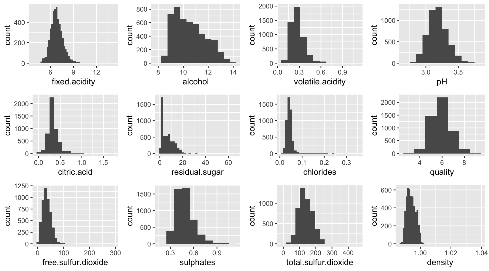

So now we can see all of our variables distributions in this  grid without any adjustmints except for the grid size. 

We can see that some of our data are long tailed such as:  voltile.acidity, chlorides and sulphates, we can try to take  the log to remove the affect:

#### Volatile Acidity:

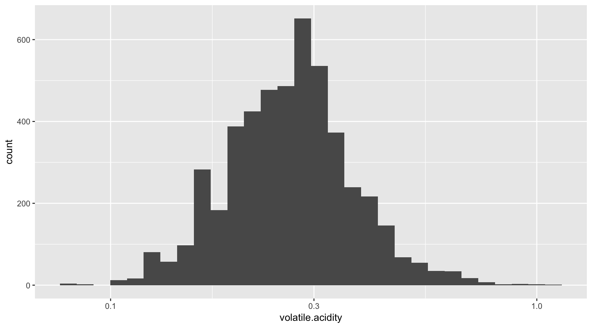

so now it appears as a kind of normally distributed and ranges from 0.1 to 1  with a peak of 0.3 which is considered low, which makes sense, cause most  quality ratings are around 6 and high quantities of volatile acidity would  lead to a vingery, unpleasent taste of the wine.

#### Chlorides:

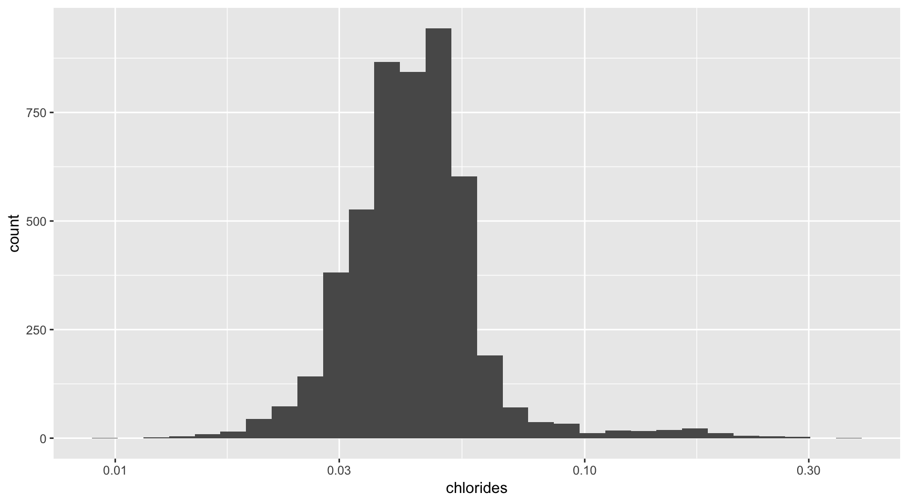

So the chlorides also appears to be kind of normally distributed now,  as seen it ranges between 0.1 and 0.3 and peaks in 0.06 approximatly. 

#### Quality

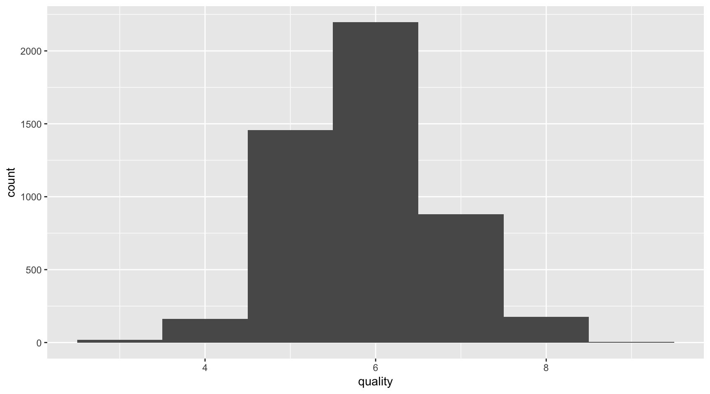

If we looked at the quality histogram we can see it ranges between 3 and 9  and no instance of our sample data got 2 nor 10 and most of the values  got approximatly 6, lets check the summary for it to make sure:

Quality Summary Statistics:

    ##    Min. 1st Qu.  Median    Mean 3rd Qu.    Max. 
    ##   3.000   5.000   6.000   5.878   6.000   9.000

So as we can see, the min is 3, max is 9 and median is 6. In order to  make the analysis easier, we'll produce another variable to rank the  quality as:

'bad' if less than 5,  'average' if less than 7,  'excellent' otherwise.

and we'll plot it again to see it in a clearer way:

#### Quality Rank

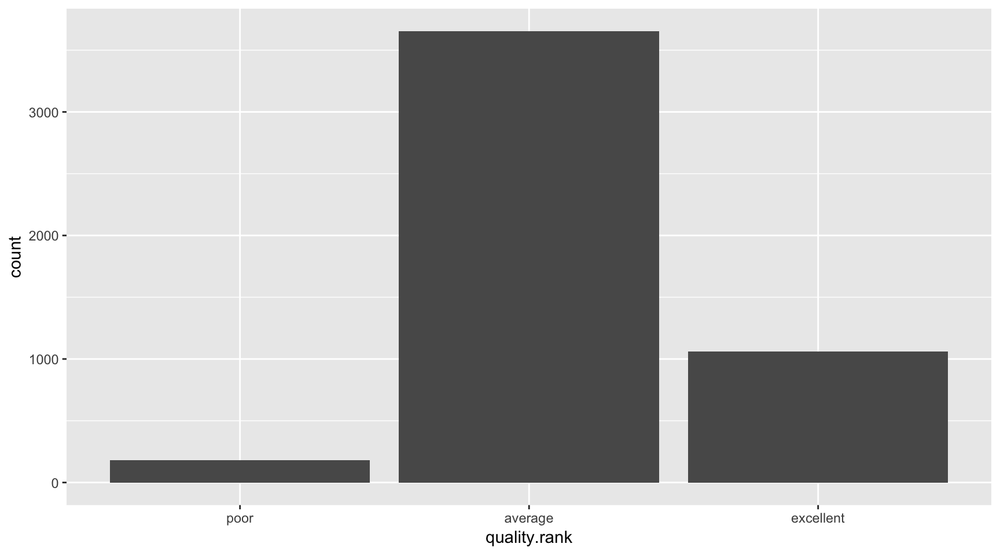

Quality Rank Summary Statistics:

    ##      poor   average excellent 
    ##       183      3655      1060

So now we can see that above 3500 instances of the sample is ranked as average,  around 1000 is excellent and less than 200 is poor, so we seem to have a pretty  good quality sample in general.

Moving on to another interseting varibale, the residual sugar:

#### Residual Sugar

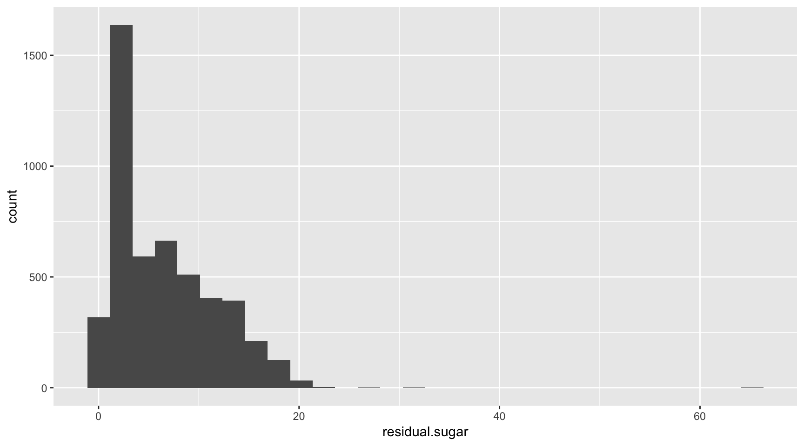

Residual Sugar Summary Statistics:

    ##    Min. 1st Qu.  Median    Mean 3rd Qu.    Max. 
    ##   0.600   1.700   5.200   6.391   9.900  65.800

Count of sweet wines \[residual.sugar &gt; 45\] :

    ##    Mode   FALSE    TRUE 
    ## logical    4897       1

we can see that residual sugar is right skewed and ranges between 0.6 and 20  with some outliers, and peaks around 2.

We know that wines greater than 45 is considered sweet, for our case we only  have one instance that is considered sweet, the rest are considered dry/off dry.

Now lets check some other variables we believe it might affect the quality  of the wine:

#### Density

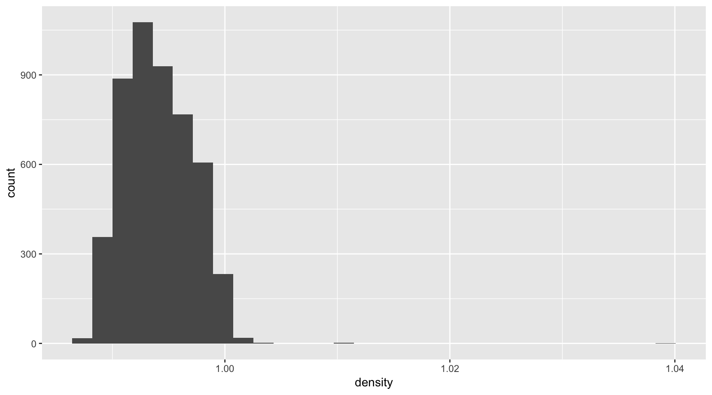

Density Summary Statistics:

    ##    Min. 1st Qu.  Median    Mean 3rd Qu.    Max. 
    ##  0.9871  0.9917  0.9937  0.9940  0.9961  1.0390

We can see that the density is normally distributed with some outliers,  and we can see that the values are relativly small, between 0.98 and 1.03

#### Total Sulfur Dioxide

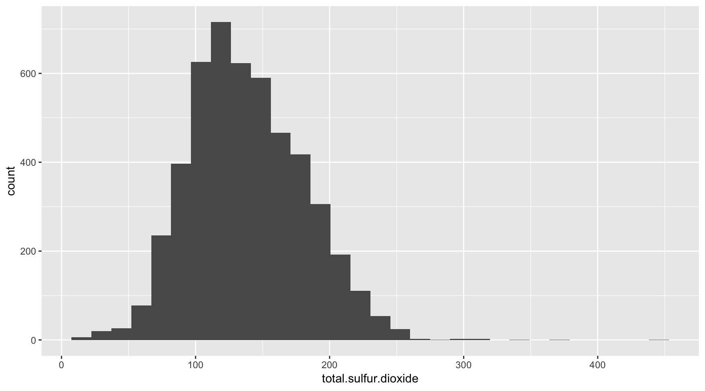

Total Sulfur Dioxide Summary Statistics:

    ##    Min. 1st Qu.  Median    Mean 3rd Qu.    Max. 
    ##     9.0   108.0   134.0   138.4   167.0   440.0

We can see that the total sulfur dioxide normally distributed,  with a median of 134 and we can see it got some outliers.

Univariate Analysis
===================

### What is the structure of your dataset?

The dataset contains 4898 instances and 14 variables.

### What is/are the main feature(s) of interest in your dataset?

The quality of the wine is the most intersesting variable to me,  hence I would like to know which variables have the most influence  on its value.

### What other features in the dataset do you think will help support your
investigation into your feature(s) of interest?

I think all the variables might have an affect on the quality
but I predict that alcohol, resedual sugar, volatile acidity and Total
Sulfur Dioxide have the most influence on the wine quality.

### Did you create any new variables from existing variables in the dataset?

I have created an ordered variable from the quality variable, named it  quality.rank and gave it the values of poor for less than 5 quality,  average for less than 7 and excellent othersise.

I believe this variable will give us clearer results.

### Of the features you investigated, were there any unusual distributions?
Did you perform any operations on the data to tidy, adjust, or change the form  

of the data? If so, why did you do this? Well, I didn't notice any strange distributions other than the long tailed  variables which I adjusted by taking the log10 for its values to see  the real distributions without any false affects.

Bivariate Plots Section
=======================

#### Correlations Between Variables

    ##                      fixed.acidity volatile.acidity citric.acid
    ## fixed.acidity                 1.00            -0.02        0.29
    ## volatile.acidity             -0.02             1.00       -0.15
    ## citric.acid                   0.29            -0.15        1.00
    ## residual.sugar                0.09             0.06        0.09
    ## chlorides                     0.02             0.07        0.11
    ## free.sulfur.dioxide          -0.05            -0.10        0.09
    ## total.sulfur.dioxide          0.09             0.09        0.12
    ## density                       0.27             0.03        0.15
    ## pH                           -0.43            -0.03       -0.16
    ## sulphates                    -0.02            -0.04        0.06
    ## alcohol                      -0.12             0.07       -0.08
    ## quality                      -0.11            -0.19       -0.01
    ##                      residual.sugar chlorides free.sulfur.dioxide
    ## fixed.acidity                  0.09      0.02               -0.05
    ## volatile.acidity               0.06      0.07               -0.10
    ## citric.acid                    0.09      0.11                0.09
    ## residual.sugar                 1.00      0.09                0.30
    ## chlorides                      0.09      1.00                0.10
    ## free.sulfur.dioxide            0.30      0.10                1.00
    ## total.sulfur.dioxide           0.40      0.20                0.62
    ## density                        0.84      0.26                0.29
    ## pH                            -0.19     -0.09                0.00
    ## sulphates                     -0.03      0.02                0.06
    ## alcohol                       -0.45     -0.36               -0.25
    ## quality                       -0.10     -0.21                0.01
    ##                      total.sulfur.dioxide density    pH sulphates alcohol
    ## fixed.acidity                        0.09    0.27 -0.43     -0.02   -0.12
    ## volatile.acidity                     0.09    0.03 -0.03     -0.04    0.07
    ## citric.acid                          0.12    0.15 -0.16      0.06   -0.08
    ## residual.sugar                       0.40    0.84 -0.19     -0.03   -0.45
    ## chlorides                            0.20    0.26 -0.09      0.02   -0.36
    ## free.sulfur.dioxide                  0.62    0.29  0.00      0.06   -0.25
    ## total.sulfur.dioxide                 1.00    0.53  0.00      0.13   -0.45
    ## density                              0.53    1.00 -0.09      0.07   -0.78
    ## pH                                   0.00   -0.09  1.00      0.16    0.12
    ## sulphates                            0.13    0.07  0.16      1.00   -0.02
    ## alcohol                             -0.45   -0.78  0.12     -0.02    1.00
    ## quality                             -0.17   -0.31  0.10      0.05    0.44
    ##                      quality
    ## fixed.acidity          -0.11
    ## volatile.acidity       -0.19
    ## citric.acid            -0.01
    ## residual.sugar         -0.10
    ## chlorides              -0.21
    ## free.sulfur.dioxide     0.01
    ## total.sulfur.dioxide   -0.17
    ## density                -0.31
    ## pH                      0.10
    ## sulphates               0.05
    ## alcohol                 0.44
    ## quality                 1.00

#### Correlations Heat Map

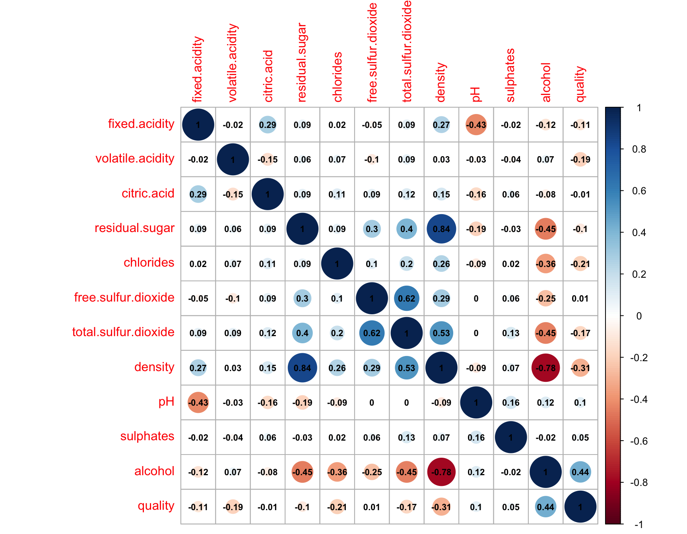

Lets explore the strongest and most intrested correlations.

So for our value of interest, the quality, we cn see that it's  positivly correlated with Alcohol, so lets plot a box plot of  the two, so we can see the relationship closly:

#### Quality and Alcohol

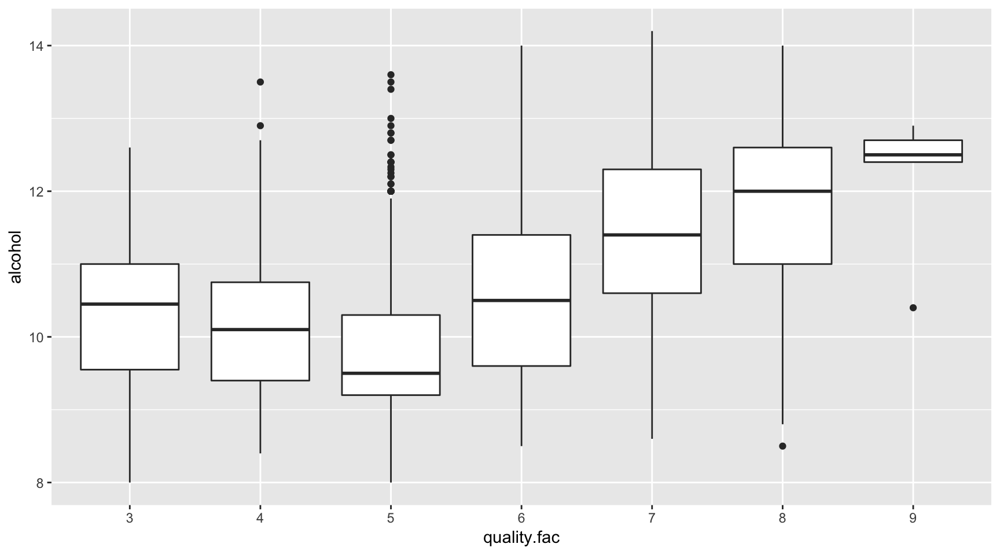

#### Quality and Quality Rank

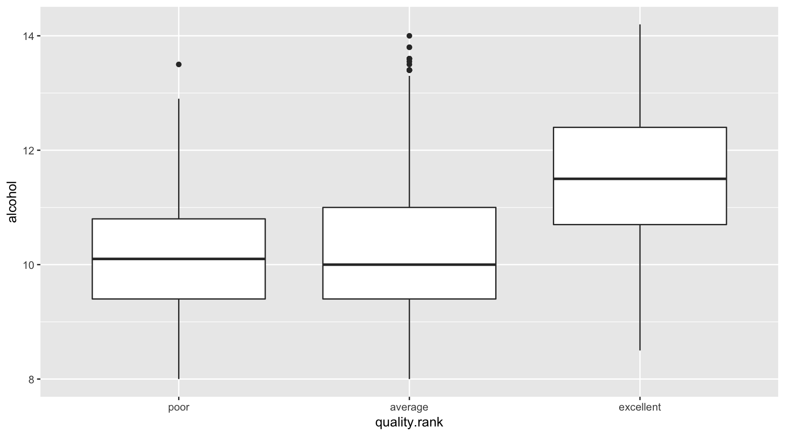

We can see the positive realtionship between the two, and we can  see that poor and average wine quality ranks gets alcohol median  of around 10, while excellent quality wine have anacohol median  of above 11.

Secondly we can check the density which have a poor/moderate  negative correlation with the quality:

#### Quality and Density

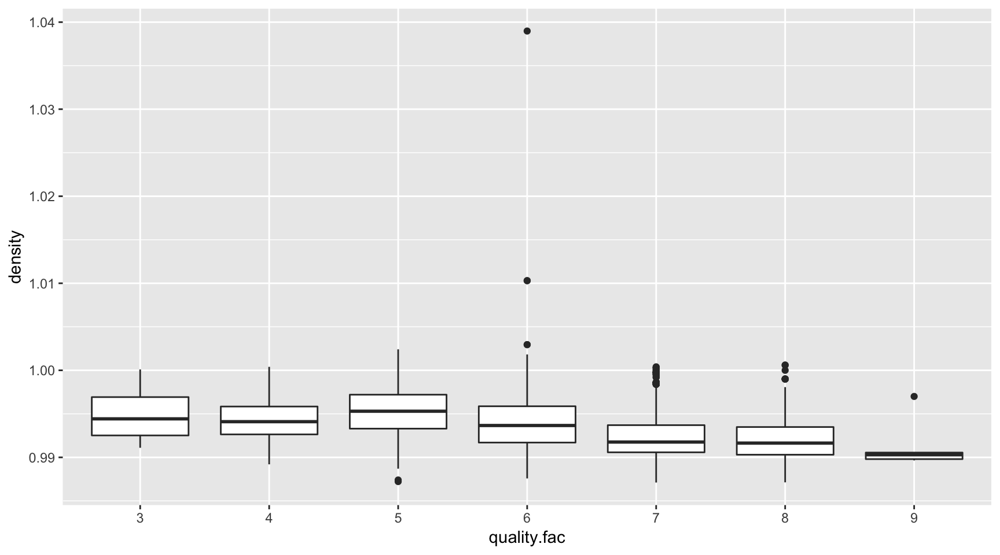

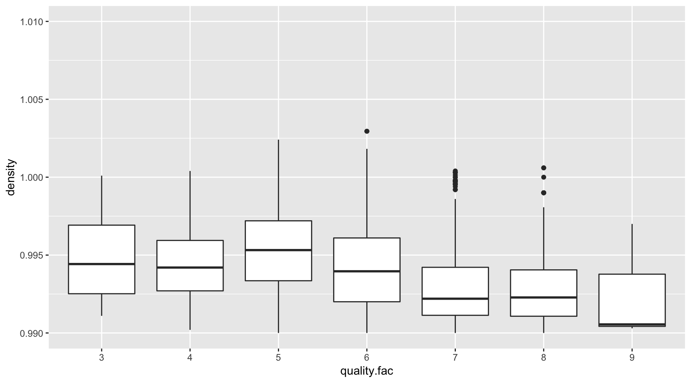

#### Quality Rank and Density

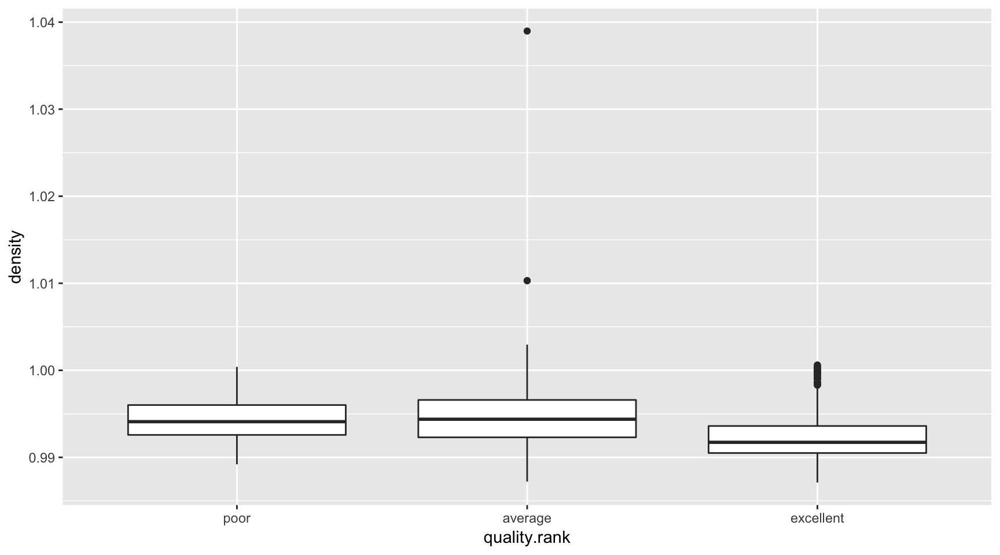

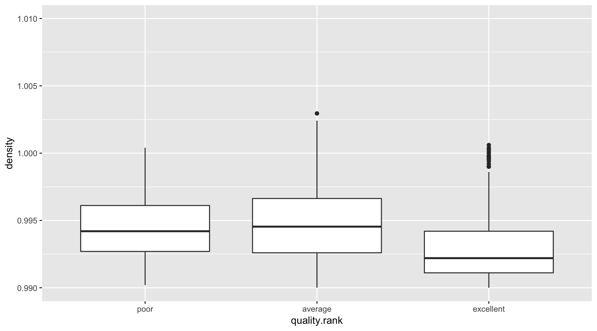

The density values are pretty small and very close to each others'  but still we can see here the negative correlation between the two,  poor and average wines seems to be neer a density median of 0.995  while excellent quality seems to get a density median of 0.992 with  some outliers near 1.

#### Quality Rank and Volatile Acidity

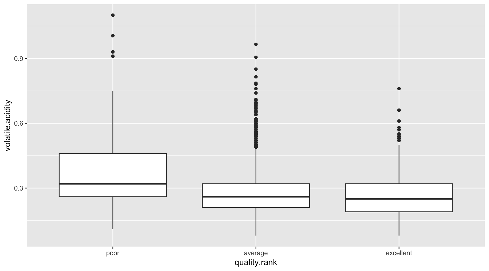

So based on the correaltion matrix and the correlation heat map,  we can see that the correlation between quality and volatile acidity  are negative and weak and we can notice the negativity here  as the quality increases.

By looking back to the heat map we can notice a strong negative  correlation between density and alcohol, the two varibales that  are correlated to the wine quality, so lets look closly into this: 

#### Alcohol and Density

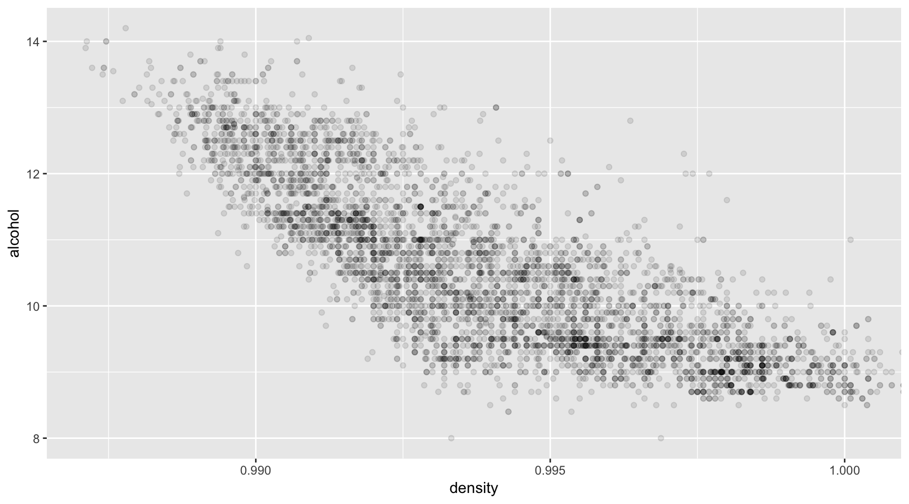

So we can see here how the density and alcohol are strongly  negativly correlated, more dense, less alcohol.

#### Residual Sugar and Density

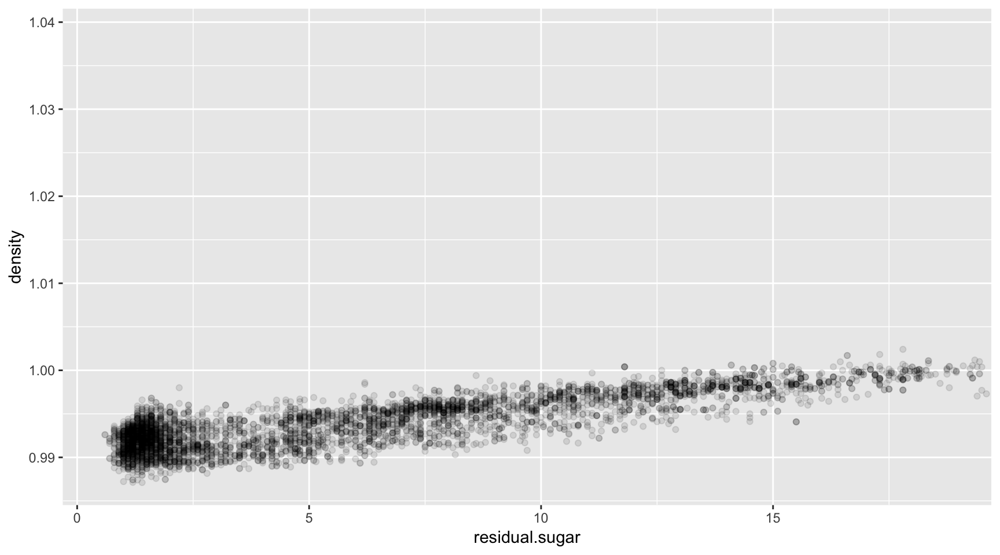

Here we can see clearly the positive strong correlation between  density and residual sugar.

The final interesting relationship I would like to dicover is  the moderate correlation between total sulfur dioxide and  residual sugar, density and alcohol:

#### Total Sulfur Dioxide and Residual sugar

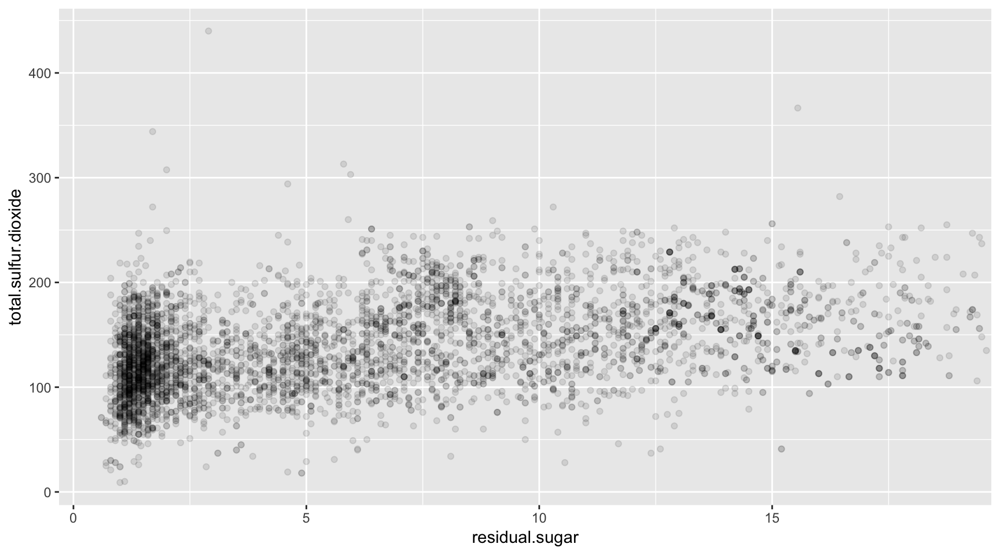

#### Total Sulfur Dioxide and Density

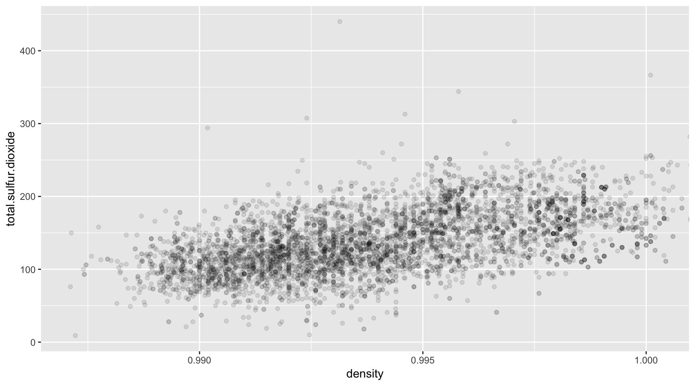

#### Total Sulfur Dioxide and Alcohol

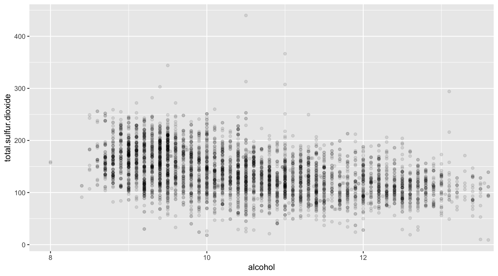

We can see from the plots the positive correlation between total  sulfur dioxide and density, total sulfur dioxide and residual  sugar and the negative correlation with alcohol.

Bivariate Analysis
==================

### Talk about some of the relationships you observed in this part of the
investigation. How did the feature(s) of interest vary with other features in  

the dataset? So in the investigation we relized that density and alcohol moderatly  correlated with the quality of the wine.

We also saw that volatile acidity is weakly correlated with the quality  of the wine, while I susbected it would be strongly correlated since  high volatile acidity might affect the taste of the wine to an  unpleasent, vinegary taste. Even though when we plotted the  quality agaisnt it we were able to see the negative corraltion clearly.

### Did you observe any interesting relationships between the other features
(not the main feature(s) of interest)?

Yes, we saw that residual sugar in wine strongly affects the density.

### What was the strongest relationship you found?

The residual sugar and density had the strongest relationship as  it was very clear in the plot.

Multivariate Plots Section
==========================

Lets plot some of the relations above and see how the quality rank will do:

#### Density, Alcohol and Quality Rank

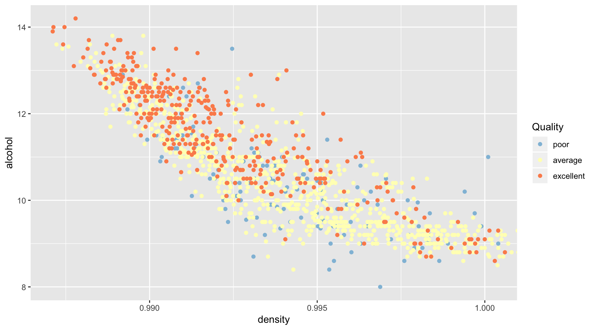

So since density and alcohol are the variables with the most direct  effect on wine quality we can clearly see that excellent wines  contains high quantity of alcohol and it's less dense.

#### Density, Residual Sugar and Quality Rank

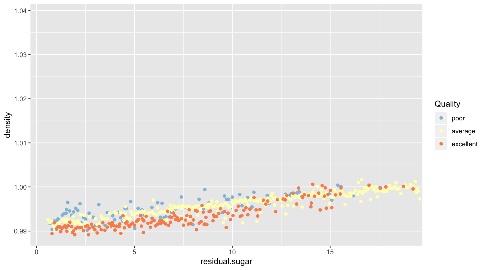

We can see here as the residual sugar increases, the density of the wine increases,  we can also see that excellent wines are relativly less dense than poor quality  wines and this has been assured by previous explorations, that excellent  wines are less dense.

#### Residual Sugar, Total Sulfur Dioxide and Quality Rank

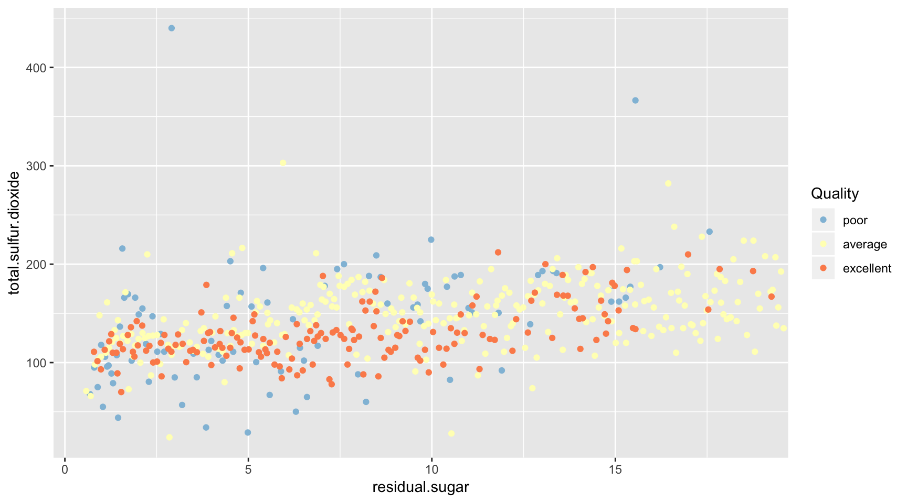

By plotting total sulfur dioxide against residual sugar we can see  the positive trend and we can see that excellent wines are less sweet  and that's expected from the negative correlation between quality  and sugar, on the other scale of total sulfur dioxide, we don't  see that much effect on the quality.

#### Alcohol, Total Sulfur Dioxide and Quality Rank

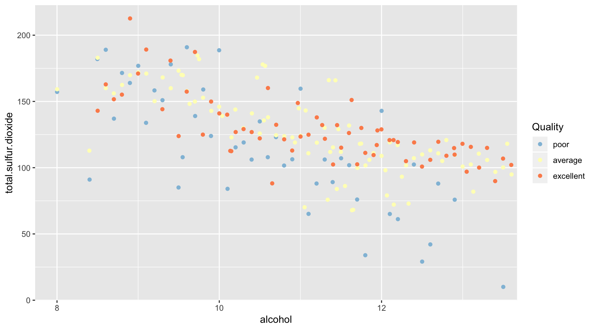

From the plot we can see that higher alcohol percentage have less total  sulfur dioxide and excellent wines seems around higher percentage of  of alcohol and a bit higher total sulfur dioxide than poor quality.

#### Density, Total Sulfur Dioxide and Quality Rank

This plot show the total sulfur dioxide against the density and we can see the strong positive correlation, excellent wines have less total sulfur dioxide and less density and that has been assured by previous explorations and plots.

Multivariate Analysis
=====================

### Talk about some of the relationships you observed in this part of the
investigation. Were there features that strengthened each other in terms of  

looking at your feature(s) of interest? Yes there was, it's the relation between density and alcohol, when we  plotted them besdie our value of interest, the quality, we clearly saw  the affect and how different ranks of quality responded.

### Were there any interesting or surprising interactions between features?

I don't believe there was, it was expected from the previous bivariate analysis.

### OPTIONAL: Did you create any models with your dataset? Discuss the
strengths and limitations of your model.

I haven't.
----------

Final Plots and Summary
=======================

### Plot One

### Description One

This plot shows our value of interest, the wine quality,  and shows how it's normally distributed between 3 and 9,  with no instances given a value of 1,2 or 10, and we can  see that the most given quality is 6. 

So it looks like we have a pretty good quality sample  overall.

### Plot Two

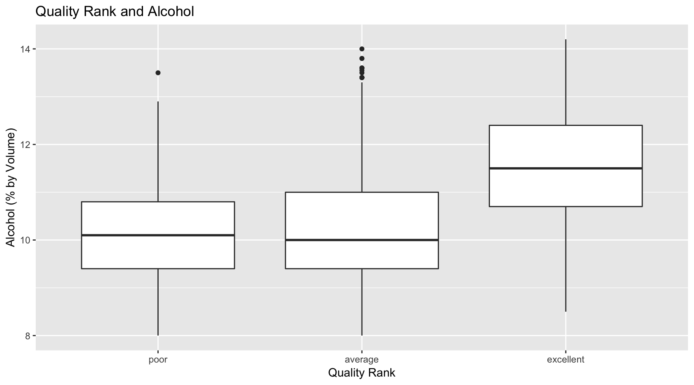

### Description Two

As the plot shows, quality rank looks positivly correlated  with alcohol perecentage, excellent wines seems to have  more alcohol percentage, and that we saw at the correlation  graph previously in the analysis since it was 0.44 which is  the strongest correlation between a varibale and the quality.

### Plot Three

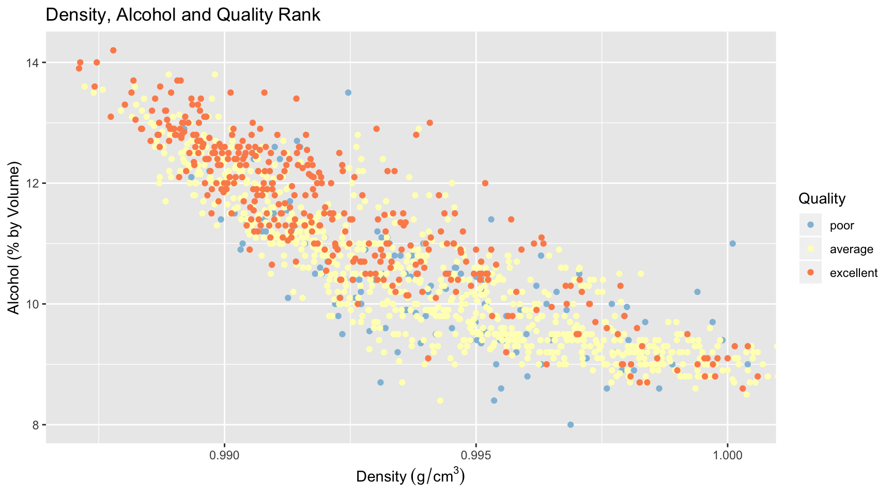

### Description Three

We can see here alcohol percentage against the density of  alcohol showing a strong negative correlation, and we can see
that excellent wines is less dense and have higher percentage of  alcohol than poor quality wines.

That has been noticed in the correlation matrix before, since  density had negative correlation with quality and alcohol had a  positive correlatin.

------------------------------------------------------------------------

Reflection
==========

So I would describe my interaction with the data in this EDA was harder in  the beggining because I didn't know where to start, but as I was exploring  it by plotting univariate histograms and see the distributions and checking  the summary statistics to see the measure of center it started to get easier.

Working on this project have introduced me to R and ggplot which I find  pretty amazing and easy to work with and very helpfull in seeing the trends  and the relations between the variables.

As a future work, I really want to apply some predection models on some  of the variables and see how it's going to affect the variable of interest.

Citation
========

P. Cortez, A. Cerdeira, F. Almeida, T. Matos and J. Reis.
Modeling wine preferences by data mining from physicochemical properties.  In Decision Support Systems, Elsevier, 47(4):547-553. ISSN: 0167-9236.

Available at: \[@Elsevier\] [http://dx.doi.org/10.1016/j.dss.2009.05.016\\](http://dx.doi.org/10.1016/j.dss.2009.05.016\) \[Pre-press (pdf)\] [http://www3.dsi.uminho.pt/pcortez/winequality09.pdf\\](http://www3.dsi.uminho.pt/pcortez/winequality09.pdf\) \[bib\] [http://www3.dsi.uminho.pt/pcortez/dss09.bib\\](http://www3.dsi.uminho.pt/pcortez/dss09.bib\)

1.  Title: Wine Quality

2.  Sources
    Created by: Paulo Cortez (Univ. Minho), Antonio Cerdeira, Fernando Almeida,  Telmo Matos and Jose Reis (CVRVV) @ 2009

Resources
=========

-   <https://ggplot2.tidyverse.org/reference/labs.html>
-   <https://stats.stackexchange.com/questions/116784/regressions-with-long-tail-variables-gdp-etc>
-   <http://rpubs.com/Mentors_Ubiqum/removing_outliers>
